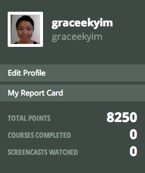

#### Include an inline screenshot of your codeschool's points from the profile page:

##QUIZ
* Explain which tabs support the following actions and how.
  * Realtime editing of HTML and CSS

  The "Elements" tab allows you to realtime edit the HTML while the "Styles" tab allows you to edit the CSS. The changes made in these tabs will not be saved. Instead, the edits will be cleared when you refresh or leave the page. If you want to change the source code, you should edit the HTML/CSS files under the "Sources" tab. 

  * Javascript Debugging

  The "Console" tab helps with JS debugging by allowing you to run your JS commands and showing log output.  

  * Performance Optimization 

  The "Network" tab allows you to evaluate how files are being downloaded to the browser. This tab includes information about the file sizes, download times and initiators. You can then determine what changes you need to make to improve performance. For example, some files may need to be downloaded in a different order or minified. 

* What's the quick key for your OS to spawn the Dev Tools inspector?

  Command + Option + I

* Go to http://www.postmachina.com/ and analyze and tweak this nicely designed page.
  * What is the current background color for the page?  (Surprisingly, it's not just black!)

  background-color: #0b0f11

  * Tweak the background color to white.
  * Tweak the height of the side bar that contains the logo.  Shrink it down to 85px.
  * Roll over the navigation links.  When you hover over them, they dissapear.  Let's change the hover color to black instead.
  * Now take a screenshot of your new (and maybe not so improved) design.  It should match this screenshot: http://postimg.org/image/5ak1jkpl5/
  * Upload your own image to the imgs directory in the `1_Chrome_Dev_Tools` directory.  It should match the image above. The last nav link in the image above is black because the mouse was hovering there when the screenshot was taken. Do the same, and don't take a screenshot of your whole desktop, just the browser window. (This is part of the challenge.)

* For the postmachina website, why can't you tweak the color of the text "The most important things are not things"?  Please explain.

The quote is from an inline gif image. If you wanted to change the color of the text, you would need to edit the gif file.

* Go to www.ticketswizard.com and analyze the page.  
  * What is the largest image on the website? 

  92624182-c482-4a35-8da2-4fbf2f502e94_Large_Large.png

  * Explain how you would find out this information, and list the URL of offending image here and how big it is.

  After opening the Dev Tools inspector, click on the "Network" tab. Make sure the cache is disabled and reload the page. You will see a list of all the files that are being downloaded. Sort the list by the column labeled "Size." Then scroll down until you find the largest image (jpeg, gif or png file). You will see the largest image is the following: http://www.ticketswizard.com/Images/Catalog/92624182-c482-4a35-8da2-4fbf2f502e94_Large_Large.png. It is 316 KB.
  
* Test the www.ticketswizard.com website with google's [PageSpeed Insights](http://www.ticketswizard.com/).  (You can also download the chrome plugin).  What is the easiest thing to change to optimize the website?  How many kilobytes of data can be eliminated?

The easiest thing to change would be to format and compress the images. You would eliminate 885.9 KB. 
